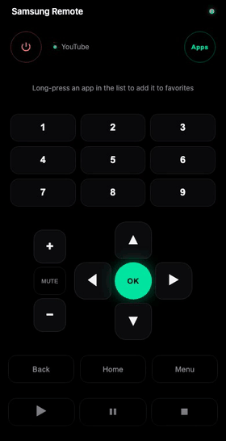

# TV Remote

[](https://github.com/tedyno/tvremote/releases)
[](https://github.com/tedyno/tvremote/pkgs/container/tvremote)
[](go.mod)
[](LICENSE)

A self-hosted web remote for Samsung Tizen TVs. Open it on your phone, add it to
the home screen, and control the TV over your LAN — including powering it on with
Wake-on-LAN. Single ~16 MB Go binary, no app store, no cloud.

> **Prefer no server at all?** There's now a native, **server-free iOS app** under
> [`ios/`](ios/) — a SwiftUI rewrite that does everything the Go server does
> (WebSocket control, Wake-on-LAN, app launching) directly on the iPhone, with
> automatic TV discovery. See [`ios/README.md`](ios/README.md).

<p align="center">
  
</p>

## Features

- **Full remote** — power, D-pad, OK, volume, numbers, navigation and media keys
- **Wake-on-LAN** — turns the TV on from standby/off (the WebSocket can't)
- **Press-and-hold** — arrows and volume repeat/accelerate like the physical remote
- **App launcher** — lists installed apps with icons, launch with a tap
- **Favorites** — long-press an app to pin it to the main screen (stored locally)
- **Live status** — shows power state and the currently active app
- **PWA** — installable to the iOS/Android home screen, runs full-screen
- **OLED design** — pure-black UI tuned for phones; tap detection so swipes don't fire buttons

## How it works

The server keeps a WebSocket open to the TV's remote-control channel
(`wss://<tv>:8002`) and exposes a small HTTP API the web client calls. Power-on
uses Wake-on-LAN (a magic packet to the TV's MAC) because a TV in standby won't
wake over the WebSocket. The real power state is read from the TV's REST API
(`http://<tv>:8001/api/v2/`). App icons are proxied from Google's favicon service
and cached.

## Quick start (Docker)

```sh
cp .env.example .env       # then edit TV_IP and TV_MAC for your TV
docker compose up -d --build
```

Or run the prebuilt multi-arch image (amd64/arm64) straight from GHCR:

```sh
docker run -d --name tvremote --network host \
  -e TV_IP=192.168.1.10 -e TV_MAC=AA:BB:CC:DD:EE:FF \
  -v "$PWD/data:/app/data" \
  ghcr.io/tedyno/tvremote:latest
```

Open `http://<host>:<SERVER_PORT>/` on your phone. On first connect the TV shows
an authorization prompt — accept it, and the pairing token is saved to `data/`.

### Finding your TV's details

- **TV_IP** — the TV's IP on your network (Settings → General → Network → Network Status).
- **TV_MAC** — the MAC of the interface the TV uses (wired or Wi-Fi). With the TV on
  and on the same subnet: `ping <TV_IP>` then `arp -n <TV_IP>`.

## Configuration

All config is via environment variables (see `.env.example`):

| Variable | Required | Default | Description |
|---|---|---|---|
| `TV_IP` | yes | — | TV IP address |
| `TV_MAC` | no | — | TV MAC for Wake-on-LAN (without it the TV can't be powered on) |
| `TV_PORT` | no | `8002` | TV remote WebSocket port |
| `SERVER_PORT` | no | `3000` | Port this server listens on |
| `APP_NAME` | no | `TVRemote` | Name shown when pairing with the TV |
| `TOKEN_FILE` | no | `./data/tv-token.txt` | Where the pairing token is stored |

## Local development

Requires [Go](https://go.dev) 1.23+.

```sh
export TV_IP=192.168.1.10 TV_MAC=AA:BB:CC:DD:EE:FF
go run ./server          # start the server
```

### CLI

A small command-line client for sending a single key:

```sh
go run ./server/cli <command>
# commands: back, chdown, chup, down, enter, home, menu, mute,
#           pause, play, power, source, stop, up
```

## Project layout

```
server/        Go server (main.go) and CLI (cli/main.go)
client/        web UI (index.html), manifest and icons
Dockerfile     multi-stage build → distroless image (~16 MB)
```

## Notes

- **No authentication** — anyone on your network can control the TV. Intended for a
  trusted home LAN. Don't expose it to the internet without putting auth in front.
- **Self-signed TLS** — the TV uses a self-signed certificate; the server skips
  verification for that one connection only.
- Tested with a Samsung RU7022 (2019, Tizen). Other Tizen models should work but
  key names or quirks may differ.

## License

[MIT](LICENSE)
